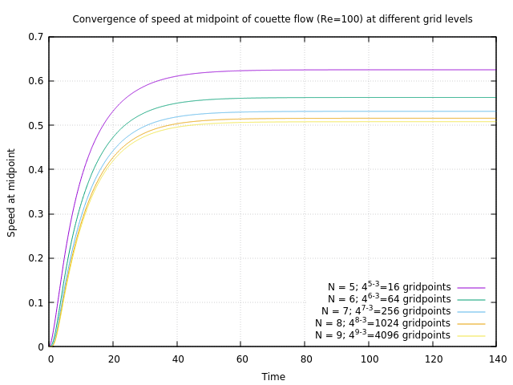
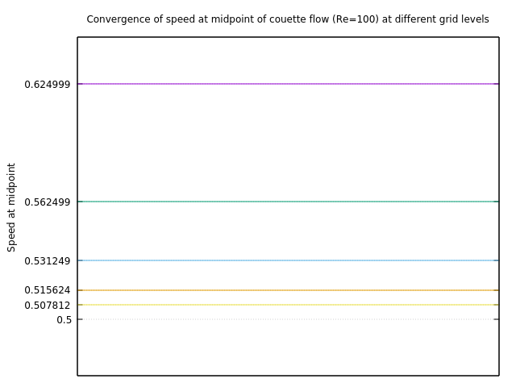

# couette-flow

A basic Couette flow simulation written in [Basilisk C](http://basilisk.fr/). Plotting in `gnuplot`.

---

## Instructions

1. Modify `MAX_LEVEL` in `couette.c` according to your hardware to find an appropriate balance between accuracy and speed.
2. Ensure ImageMagick and Basilisk is installed on your system.
3. Run 'run.sh' to obtain an animation.

---

## Plots

---

## Animation stills

`t = 0.1`

`t = 5.8`

`t=11.5`
